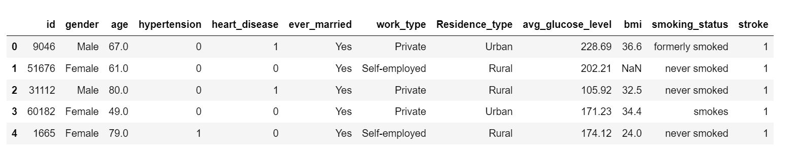
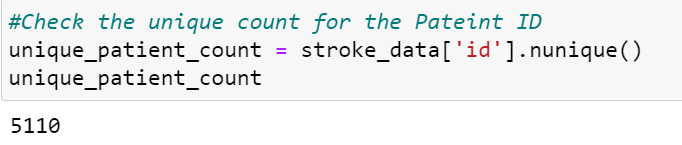
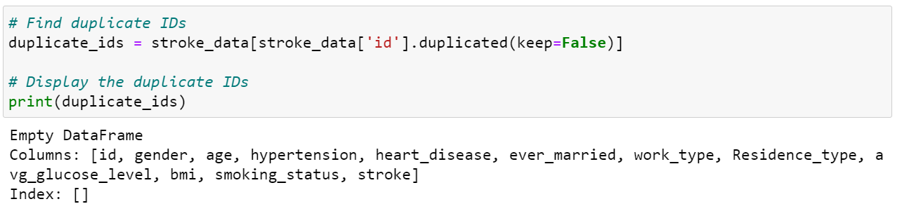
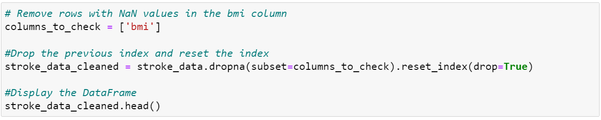
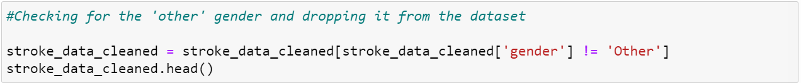
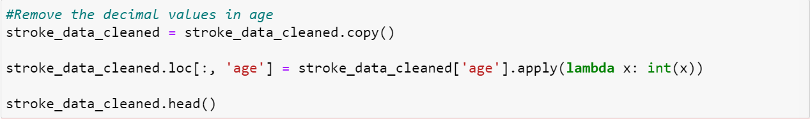
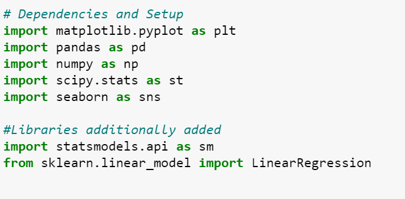
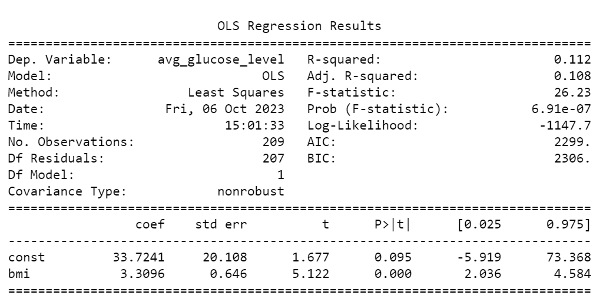
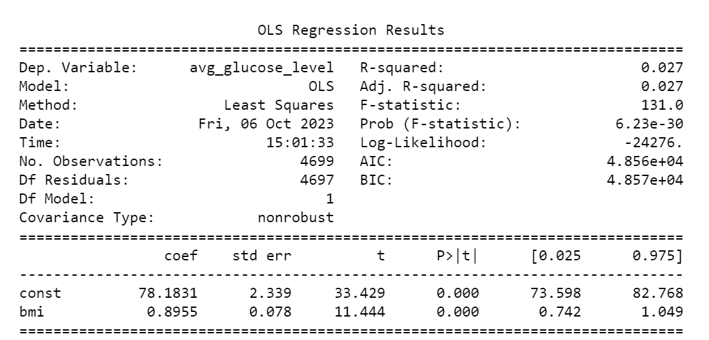

# StrokeScope_Insights_into_Stroke_Occurrence

Here is the  stroke  analysis & report

## 1 Introduction 

- Stroke is a leading cause of disability and mortality worldwide, making it a critical area of study in the field of public health.

- It is a critical health condition with severe consequences, making proactive risk assessment and targeted interventions imperative for minimizing its impact.

- Our analysis delves into a comprehensive examination of stroke data to better understand its risk factors and implications for healthcare. 

- Stroke data analysis serves as a valuable tool for identifying potential risk factors, developing preventive strategies, and enhancing patient care. 

- In this report, we aim to explore the dataset, uncover key insights, and address specific research questions related to stroke occurrence.

- We will begin by providing an overview of the dataset, detailing its structure and contents. Subsequently, we will delve into the exploratory analysis, where we will examine various health condition such as hypertension, heart disease, smoking status with respect to  age, gender, work type , and more. 

## 2 Data Source

The dataset used in this analysis comprises  from Kaggle https://www.kaggle.com/competitions/playground-series-s3e2/overview  and offers a wealth of information about individuals and their health attributes. 

## 3 Research Questions

We would like to address the above concerns by answering the following questions through our insights and analysis:

- Determine the most significant risk factors associated with stroke, such as hypertension, smoking, diabetes, obesity, and more.

- Assess the relative importance of these risk factors through statistical analysis like logistic regression.

- Classification on the basis of gender, and age group with different work types.

- Assess an individual's risk of experiencing a stroke based on their demographic and health-related attributes.

- Examine how stroke rates is effected based on marital status, bmi, residnece and smoking habit. 

- Can we identify other key factors or combinations of factors that correlate strongly with stroke incidence.

## 4  Data Preprocessing

Data preprocessing is a crucial step in our analysis pipeline, where we prepared the raw data for meaningful analysis. This phase involved several tasks to clean and transform the data to make it suitable for our specific analysis goals.

### 4.1 Data Cleaning

During data cleaning, we addressed the following issues related to missing data/null values and other inconsistencies in the dataset:

Identify the total number of rows.

Ensuring that there are no duplicate values.

Remove the null values from possible columns.

Dropping the gender other than female and male.

Convert the required data type.

We get our cleaned data with total number of counts.

## 5 Exploratory Data Analysis (EDA)

### 5.1 Tools & Libraries Used

For our analyis, we used the Python Jupyter Notebook with additional  libraries for regression and statictical calucations.

### 5.2 Data Visualizations & Analysis

Let's view at a glance all the stroke rate with certain health conditions, with repect to who have the stroke and who don't get the stroke.(For stroke status... O sets as "N0", 1 sets as "Yes")

- The figure depicts that the patients with 'hypertension & heart disease' are more likely to have stroke than the ones who do not have it.

- The stroke rate for the people suffering from hypertension and heart disease is above 12% whereas those who don't suffer from same health conditions stands under 4%.

- According to BMI, we observed that the obesity is directly proportional to chances of strokes and vice versa.

- The pie chart shows the total patients ages are classified with different groups and bar chart splits them on the basis of stroke occurence.

- It seems like the most ocurrence of stroke lies in the senior age and there seems almost no occurence in the remaining other age groups.

- The pie char represent the classification for male and females and shows that we have more female patients than females.

- Females have slightly high occurence of stroke with 2.4% whereas the males are only 1.8%.

With stroke, the stacked column chart:

- Total females  stroke patients: 98

- Total number of males stroke patients: 120

- The pie chart shows the overall distrubution on the basis of marital status.

- Married people have more probabilty of having stroke as compare to unmarried ones. 

- The pie chart repersents differentwork types such as self-employed, govt job, etc.

- The bar chart depicts that the private job holders have highest stroke rate among the other categories.

Crystal clear from both visualization that there is no significant impact by the change in residence.

It is quite obvious from the visualiations that the smoking status is negligible risk factor for stroke.  

From the stacked column chart shows that there is not high difference between hypertension and heart disease pateints hve almost the same occurence of stroke.

## 5.3 Scatter Plots &  Regression Analysis

The scatter plot displays the data points for both the stroke patients and who don't have stroke on the basis of "BMI vs. glucose level".

- This scatter plots represetns the regression analysis for stroke pateints.

- Here the r value is 0.1 that is close to 0. So, there is a weak correlation between bmi & glucose level.

- This regression analysis are about those patients who don't have the stroke.

- The r value is close to  0 i.e. 0.02. It confirms that there is no significant relationship between BMI & Glucose level for chances of stroke.

## 6 Conclusions

### 6.1 Responses for Research Questions

- Age is a significant risk factor for stroke, with individuals above the age of 65 having the highest stroke risk.

- Hypertension and heart disease are strongly associated with an increased risk of stroke.

- Gender does not appear to be a significant predictor of stroke risk in this dataset.

- As females have slightly high occurence of stroke with 2.4% whereas the males are only 1.8%.

- The marital status shows a high stroke percentage in married individuals i.e. 3.8% whereas the unmarried patients have only 0.5% occurence in stroke.

- Exploring the work type, it strongly shows that the 'private' job holders are at a high risk of stroke with 2.6% than the other work categories less than 1%. 

- Residence factor does not have any significant impact for the occurence of stroke as the number is only about 2%.

- There is a poor correlation between BMI and stroke risk, particularly in obese individuals with all values of 'r' close to 0.

### 6.2 Observations Analysis Summary

- Understanding the interplay of age, hypertension, and heart disease is crucial for stroke prevention efforts.

- While gender does not emerge as a significant predictor in this dataset, it's important to continue studying gender-based stroke risk factors in larger datasets.

- Smoking cessation programs and initiatives to reduce obesity should be priorities in stroke prevention strategies.

- Further research is needed to explore the reasons for the urban-rural disparity in stroke incidence.

## Authors

## [Maira Syed GitHub](https://github.com/mairasyed)

## [Aruna  Venkatachalam GitHub](https://github.com/arunavenkatachalam)

## [Jalees Moeen GitHub](https://github.com/JaleesMoeen)